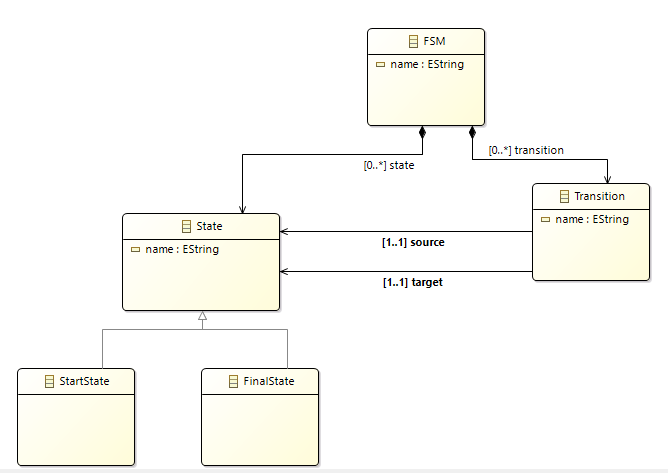

# TP-DSL-Gemoc

*Ce qui à été fait :*
* Compilateur : OK  ;
* Interpreteur : NOK ;
***

## Compilateur :

### Modèle de classe **tp01.ecore** :



### Fichier **MyDsl.xtext** :

```java
// automatically generated by Xtext
grammar org.xtext.example.mydsl.MyDsl with org.eclipse.xtext.common.Terminals

import "http://www.example.org/tp01"
import "http://www.eclipse.org/emf/2002/Ecore" as ecore

FSM returns FSM:
	{FSM}
	'FSM'
	name=EString
	state+=StartState
	state+=FinalState
	(state+=State | transition+=Transition)*
	;

State returns State:
	{State}
	'State'
	name=EString
	;

Transition returns Transition:
	'Transition'
	name=EString
	source=[State|EString] '->' target=[State|EString]
	;
	
StartState returns StartState:
	{StartState}
	'StartState'
	name=EString;

FinalState returns FinalState:
	{FinalState}
	'FinalState'
	name=EString;

EString returns ecore::EString:
	STRING | ID;

```

### Fichier **doGenerator.java** :
```java
/*
 * generated by Xtext 2.14.0
 */
package org.xtext.example.mydsl.generator

import org.eclipse.emf.ecore.resource.Resource
import org.eclipse.xtext.generator.AbstractGenerator
import org.eclipse.xtext.generator.IFileSystemAccess2
import org.eclipse.xtext.generator.IGeneratorContext
import fr.ut2j.tp01.FSM
import fr.ut2j.tp01.FinalState
import fr.ut2j.tp01.State
import fr.ut2j.tp01.Transition
import fr.ut2j.tp01.StartState

/**
 * Generates code from your model files on save.
 * 
 * See https://www.eclipse.org/Xtext/documentation/303_runtime_concepts.html#code-generation
 */
class MyDslGenerator extends AbstractGenerator {

	override void doGenerate(Resource resource, IFileSystemAccess2 fsa, IGeneratorContext context) {
		val myfsm = resource.contents.get(0) as FSM
		fsa.generateFile('FSM.java', generateFSMProgrammCode(myfsm))
		fsa.generateFile('State.java', generateStateProgrammCode())
		fsa.generateFile('Transition.java', generateTransitionProgrammCode())
	}
	
	/**
	 * Permet de générer la classe principale myDSL
	 */
	def String generateFSMProgrammCode(FSM fsm) { 
		return
		'''		
		import java.util.ArrayList;
		import java.util.List;
		
		public class FSM {
				
				private List<State> states;
				private List<Transition> transitions;
				private String name;
				private State currentState;
				
				/**
				 * Constructeur de la classe
				 */
				private FSM(String newName){
					this.states = new ArrayList<State>();
					this.transitions = new ArrayList<Transition>();
					this.name = newName;
				}
				
				public void setName(String newName){
					this.name = newName;
				}
				
				public String getName(){
					return this.name;
				}
				
				public void setCurrentState(State currentState) {
					this.currentState = currentState;
				}
				
				public void addState(State s) {
					this.states.add(s);
				}
				
				public void addTransition(Transition t) {
					this.transitions.add(t);
				}
				
				/**
				 * Permet d'appeller la méthode "transit" de chaque classe Transit
				 */
				public void transitAll() {
					for(int i = 0; i < transitions.size(); i++) {
						this.currentState = transitions.get(i).transit(this.currentState);
					}
				}
				
				public static void main(String[] args) {
					
					FSM «fsm.name» = new FSM("«fsm.name»");
					
					«FOR state : fsm.state.filter(State)»
						State «state.name» = new State("«state.name»");
						«fsm.name».addState(«state.name»); // Garde en mémoire tous les états
					«ENDFOR»
					
					«fsm.name».currentState = «fsm.state.filter(StartState).get(0).name»; // Associe le startState au current state de la classe.
					
					«FOR transition : fsm.transition»
						Transition «transition.name» = new Transition("«transition.name»",«transition.source.name», «transition.target.name»);
						«fsm.name».addTransition(«transition.name»); // Garde en mémoire toutes les transitions
					«ENDFOR»
					
					while(«fsm.name».currentState != «fsm.state.filter(FinalState).get(0).name») {
						«fsm.name».transitAll();
					}
				}
		}
		'''
	}
	
	/**
	 * Génére la classe State
	 */
	def String generateStateProgrammCode(){
		'''
		public class State {
			
			private String name;
			
			public State(String newName) {
				this.name = newName;
			}
			
			public void setName(String newName) {
				this.name = newName;
			}
			
			public String getName() {
				return this.name;
			}
		
		}
		'''
	}
	
	/**
	 * Génére la classe de Transition
	 */
	def String generateTransitionProgrammCode(){
		'''
		public class Transition {
			
			private String name;
			private State input;
			private State output;
			
			public Transition(String newName, State in, State out) {
				this.name = newName;
				this.input = in;
				this.output = out;
			}
			
			public void setName(String newName) {
				this.name = newName;
			}
			
			public String getName() {
				return this.name;
			}
			
			public String getInputName() {
				return this.input.getName();
			}
			
			public State getInputState() {
				return this.input;
			}
			
			public String getOutputName() {
				return this.output.getName();
			}
			
			public State getOuputState() {
				return this.output;
			}
			
			/**
			 * Vérifie que le current state de la classe principale correspond à l'input
			 */
			public State transit(State dslState) {
				if (this.input == dslState && this.output != dslState) {
					System.out.println(this.input.getName() + " -> " + this.output.getName());
					return this.output;
				}
				return dslState; // Retourne le nouvel état
			}
		}
		
		'''
	}
}

```
***